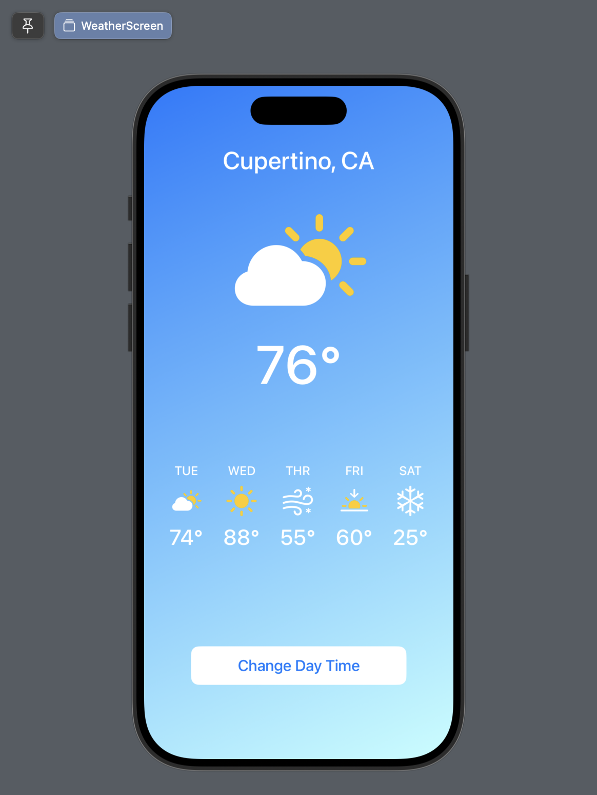
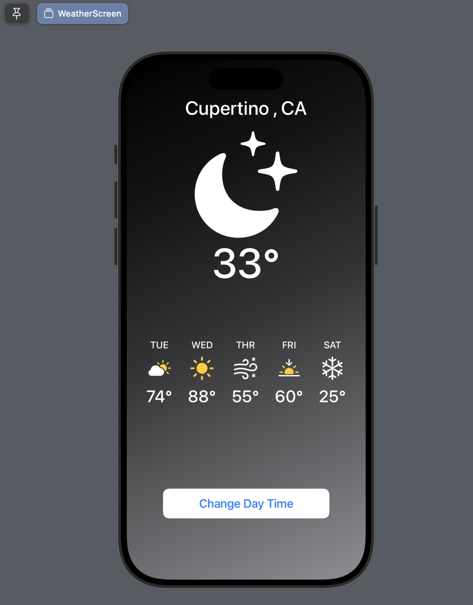

<p align="center">
  
</p>

# 📱 iOS Development Roadmap (For Android Developers)

Welcome to the **iOS Development Roadmap**, specially designed for Android developers looking to transition smoothly into native iOS development.

---

## 📅 Weekly Learning Plan

### 🚀 Week 1: Learn Swift Programming  
> Master Swift basics to prepare for building real iOS apps.

- Swift syntax, variables, constants  
- Control flow (`if`, `switch`, loops)  
- Functions and parameters  
- Collections: Arrays, Sets, Dictionaries  
- Structs vs Classes  
- Optionals, Protocols, Closures  


```swift

import UIKit

//  Variables and Print
var greeting = "Hello, Swift Programming"
print(greeting)

//  if-else Statement
let score = 90
if score >= 80 {
    print("Good Marks")
} else if score >= 60 {
    print("Pass")
}

//  switch Statement
let day = "Monday"
switch day {
case "Monday":
    print("Today is Monday")
case "Tuesday":
    print("Today is Tuesday")
default:
    print("Today is not Monday or Tuesday")
}

//  for Loop
for i in 1...3 {
    print(i)
}

//  Functions
func greet(name: String) -> String {
    return "Hello, \(name)!"
}
print(greet(name: "This is a swift function"))

func square(number: Int) -> Int {
    number * number
}
print(square(number: 10))

//  Arrays
var fruits = ["apple", "banana", "orange"]
fruits.append("mango")
print(fruits)

//  Sets
var fruit: Set = ["apple", "banana", "orange"]
print(fruit)

//  Dictionary
var fruitCount = ["apple": 2, "banana": 5, "orange": 4]
print(fruitCount)

//  Struct (like `data class` in Kotlin)
struct Person {
    var name: String
    var age: Int
}
let person1 = Person(name: "Alice", age: 25)
print(person1.name)

//  Optional (Elvis Operator)
var username: String? = "Zia"
print(username ?? "Anonymous") // prints "Zia"

username = nil
print(username ?? "Anonymous") // prints "Anonymous"

//  Optional Binding
let name: String? = "zia"
print(name ?? "unknown name")

//  Protocol (like `interface` in Kotlin)
protocol Name {
    func school()
    func level()
}

// Closures (like `lambda` in Kotlin)
let development = { (name: String) in
    print(name)
}
development("iOS Development")
```
---

### 🚀 Week 2: iOS App Basics + SwiftUI  
> Understand UIKit fundamentals, Storyboards, and app lifecycle.

- Xcode project structure  
- App lifecycle
- Layout (`VStack`, `HStack`, `ZStack`, `Spacer`, `Divider`, `ScrollView`, `GeometryReader`, `LazyVStack`, `LazyHStack`, `LazyVGrid`, `LazyHGrid`) 
- UI Elements (`Text`, `Image`, `Label`, `Link`, `TextField`, `SecureField`, `Button`, `Toggle`, `Slider`, `Stepper`, `Picker`, `DatePicker`, `ColorPicker`, `ProgressView`)
- Container and Navigation (`NavigationStack`, `NavigationLink`, `TabView`, `List`, `ForEach`, `Form`, `Section`, `Group`, `Sheet`, `Alert`, `Popover`, `Menu`)
- State and Data (`@State`, `@Binding`, `@StateObject`, `@ObservedObject`, `@Environment`, `@EnvironmentObject`, `@AppStorage`, `@FocusState`) 
- Modifier (`.padding()`, `.frame()`, `.background()`, `.foregroundColor()`, `.font()`, `.cornerRadius()`, `.shadow()`, `.opacity()`, `.offset()`, `.rotationEffect()`, `.scaleEffect()`)

**1. BUTTON (Action, Label, Style)**
 ```swift
VStack {
    Button {
        print("Button Pressed")
    } label: {
        Text("Press Me")
    }
    .padding()
    .background(Color.blue)
    .foregroundColor(.white)
    .clipShape(Capsule())
}
```
**2. Color (primary,secondary,rgb,asset color)**

```swift
/// provided color .foregroundColor(Color.red)
/// primary color .foregroundColor(Color.primary) --> automatically handle for light and dark them
/// secondary color .foregroundColor(Color.secondary) color which used same for both light and dark them
/// rgb color .foregroundColor(Color.init(red: 100/255, green: 50/255, blue: 0/255))
/// asset color
            
Rectangle()
    .foregroundColor(Color.black)
    .frame(width: 200, height: 100)
```
**3. System icon in swiftUI (SFSybmol)**

```swift
Image(systemName: "xmark.circle.fill")
                .resizable()
                .frame(width: 50, height: 50)
                .foregroundColor(.red)
```
**4. Frame & Alignments**

```swift
/// center,leading,trailing,top,topleading,toptrailing,bottom,bottomleading,bottomtrailing

Text("Hello, SwiftUI!")
                .background(.red)
                .foregroundColor(.white)
                .frame(width: 200,height: 200,alignment: .center)
                .background(.blue)
```
**5. Weather Screen**
<div style="display: flex; justify-content: center; align-items: center; gap: 16px;">
  
  
</div>
<br><br>

```swift

import SwiftUI

struct WeatherScreen: View {
    @State private var isNight = false
    var body: some View {
        ZStack{
            BackgroundView(isNight: $isNight)
            VStack{
                CityNameView(cityName: "Cupertino , CA")
                MainWeatherView(imageName: isNight ? "moon.stars.fill" : "cloud.sun.fill",highTemperature: isNight ? 33 : 76)
                HStack(spacing: 26){
                    WeatherDayView(dayOfWeek: "TUE", imageName: "cloud.sun.fill", highTemperature: 74)
                    WeatherDayView(dayOfWeek: "WED", imageName: "sun.max.fill", highTemperature: 88)
                    WeatherDayView(dayOfWeek: "THR", imageName: "wind.snow", highTemperature: 55)
                    WeatherDayView(dayOfWeek: "FRI", imageName: "sunset.fill", highTemperature: 60)
                    WeatherDayView(dayOfWeek: "SAT", imageName: "snow", highTemperature: 25)
                }
                Spacer()
                Spacer()
                Button(){
                    isNight.toggle()
                }label: {
                    WeatherButtonView(title: "Change Day Time",
                                      backqroundColor: .white,
                                      forgoundColor: .blue)
                }
                Spacer()
                
                
            }
            
        }
    }
}

struct BackgroundView: View {
    @Binding var isNight: Bool
    
    var body: some View {
        LinearGradient(gradient: Gradient(colors: [isNight ? .black : .blue,isNight ? .gray : Color("lightBlue")]), startPoint: .topLeading, endPoint: .bottomTrailing)
            .edgesIgnoringSafeArea(.all)
    }
}

struct CityNameView: View {
    var cityName: String
    var body: some View {
        Text(cityName)
            .font(.system(size: 32, weight: .medium))
            .foregroundColor(.white)
    }
}

struct WeatherDayView: View {
    var dayOfWeek: String
    var imageName: String
    var highTemperature: Int
    var body: some View {
        VStack{
            Text(dayOfWeek)
                .font(.system(size: 16,weight: .medium,design: .default))
                .foregroundColor(.white)
            Image(systemName: imageName)
                .renderingMode(.original)
                .resizable()
                .aspectRatio(contentMode: .fit)
                .frame(width: 40, height: 40)
            Text("\(highTemperature)°")
                .font(.system(size: 28, weight: .medium))
                .foregroundColor(.white)
        }
    }
}

struct MainWeatherView: View {
    var imageName:String
    var highTemperature:Int
    var body: some View {
        VStack(spacing:0){
            Image(systemName: imageName)
                .renderingMode(.original)
                .resizable()
                .aspectRatio(contentMode: .fit)
                .frame(width: 180, height: 180)
            Text("\(highTemperature)°")
                .font(.system(size: 70, weight: .medium))
                .foregroundColor(.white)
            
        }
        .padding(.bottom,80)
    }
}

struct WeatherButtonView: View {
    var title: String
    var backqroundColor: Color
    var forgoundColor: Color
    var body: some View {
        Text(title)
            .frame(width: 280, height: 50)
            .background(backqroundColor)
            .foregroundColor(forgoundColor)
            .font(.system(size: 20, weight: .medium, design: .default))
            .cornerRadius(10)
    }
}


#Preview {
    WeatherScreen()
}

```

## 1. Xcode Project Structure (SwiftUI)

| Android (Kotlin)                     | iOS (SwiftUI)                           |
|-------------------------------------|-----------------------------------------|
| `AndroidManifest.xml`               | `Info.plist` (app config and permissions) |
| `MainActivity.kt`                   | `@main struct YourApp: App {}` (entry point) |
| `res/layout/*.xml`                  | SwiftUI `.swift` View files (e.g., `HomeView.swift`) |
| `res/drawable`, `mipmap`            | `Assets.xcassets` (images, app icons, colors) |
| `build.gradle`                      | Xcode project build settings             |
| `src/main/java/`                    | Swift files inside project folder        |
| `themes.xml`, `colors.xml`          | `Assets.xcassets` for colors & design   |

### SwiftUI Project Structure Example

```

MySwiftUIApp/
├── MySwiftUIAppApp.swift   ← Main entry point (@main)
├── ContentView\.swift       ← First View
├── Views/                  ← All SwiftUI views
├── Models/                 ← Data models
├── ViewModels/             ← For MVVM architecture
├── Resources/
│   ├── Assets.xcassets     ← Images, Colors
│   └── LaunchScreen.storyboard ← Launch screen (optional)
├── Info.plist              ← App metadata

```

## 2. App Lifecycle in SwiftUI

| Android (Kotlin)                    | IOS (SwiftUI)                        |
| ----------------------------------- | ------------------------------------ |
| `Application.onCreate()`            | `@main App` struct init              |
| `Activity.onCreate()`               | `WindowGroup {}` launches first view |
| `onResume()` / `onPause()`          | `.onAppear()` / `.onDisappear()`     |
| `Activity.finish()` / `onDestroy()` | deinit (if needed)                   |

### IOS App Entry Point (SwiftUI)

```swift
import SwiftUI

@main
struct TranslatorApp: App {
    var body: some Scene {
        WindowGroup {
            SplashScreenView()
        }
    }
}
```

### View Lifecycle (SwiftUI)

```swift
import SwiftUI

@main // app entry poiont
struct TranslatorApp: App {
    @Environment(\.scenePhase) var scenePhase
    init() {
        print("app launched")
    }
    var body: some Scene {
        WindowGroup {
            SplashScreenView()
                .onAppear {
                    print("content view appeared")
                }
                .onDisappear {
                    print("content view disappeared")
                }
        }
        .onChange(of:scenePhase){ newPhase in
            switch newPhase {
            case .active:
                print("app become active")
            case .inactive:
                print("app become inactive")
            case .background:
                print("app go to background")
            @unknown default:
                print("no app state")
            }
            
        }
    }
}
```

---

### 🚀 Week 3: Intermediate UIKit & TableViews  
> Work with lists, adapters, user inputs, and navigation.

- UITableView (list view)  
- Delegates & DataSources  
- Forms: TextField, Button, Alert  
- Passing data between ViewControllers  
- Custom Cells  

---

### 🚀 Week 4: SwiftUI Basics  
> Learn Apple’s modern declarative UI framework.

- SwiftUI vs UIKit  
- Views, modifiers, navigation  
- State management (`@State`, `@Binding`, `@ObservedObject`)  
- Lists, Forms, VStack, HStack, ZStack  
- NavigationStack & Sheets  

---

### 🚀 Week 5: Advanced SwiftUI Concepts  
> Dynamic UI, animations, and architecture.

- Combine basics (Publisher, Subscriber)  
- MVVM Architecture  
- Custom reusable Views  
- Animations  
- SwiftUI & UIKit integration  

---

### 🚀 Week 6: Networking & APIs  
> Work with REST APIs, JSON parsing, and async operations.

- URLSession & async/await  
- Codable (Decodable & Encodable)  
- Displaying API data in UI  
- Error handling  
- Loading indicators  

---

### 🚀 Week 7: Persistence & Local Storage  
> Save data locally using modern techniques.

- UserDefaults  
- CoreData basics  
- File storage (read/write)  
- Optional: Realm database  

---

### 🚀 Week 8: Testing, Debugging & Deployment  
> Prepare your app for production.

- Unit Testing with XCTest  
- UI Testing  
- Crash reporting tools (e.g., Firebase Crashlytics)  
- App Icons & Launch Screens  
- TestFlight beta distribution  
- Publishing to App Store  

---

## 🛠️ Tools Required

- macOS
- Xcode
- Swift  
- Git + GitHub  

---

# 📱 Android vs iOS Development Comparison (Beginner to Advanced)

This document provides a **complete roadmap and component-level comparison** for Android developers transitioning to iOS (Swift, SwiftUI, and UIKit). It includes comparisons of UI views, image formats, architecture patterns, asynchronous programming, and more.

---

## Part 1: Image Format & Usage Comparison

| **Use Case / Format**       | **Android**                         | **iOS**                              | **Notes / Alternate**                                                  |
|-----------------------------|--------------------------------------|--------------------------------------|------------------------------------------------------------------------|
| **Vector Images**           | `SVG` (`res/drawable/`)              | `PDF` (vector), `SF Symbols`         | iOS **does not support SVG directly**, use **PDF** instead             |
| **Raster Images**           | `PNG`, `JPG`, `WEBP`                 | `PNG`, `JPG`, `HEIC`, `WEBP` (iOS 14+) | PNG is preferred for UI; HEIC is default for iPhone photos             |
| **Adaptive Icons**          | XML shapes, foreground/background    | `AppIcon` set with multiple sizes    | Use asset catalog (`.xcassets`) in iOS                                |
| **Nine-patch Images**       | `.9.png` (stretchable image)         | `resizableImage(withCapInsets:)`     | Use stretchable image in iOS with insets                              |
| **Lottie Animations**       | `.json` with Lottie library          | `.json` with Lottie iOS              | Cross-platform support (same `.json`)                                 |
| **System Icons**            | `@drawable/ic_home` or `VectorAsset`| `Image(systemName: "house")` (SF Symbols) | SF Symbols = Apple’s official scalable icon set              |

---

## Part 2: Architecture & Asynchronous Programming

| Concept                    | Android (Kotlin)                                        | iOS (Swift)                                         | Notes                                                                 |
|---------------------------|----------------------------------------------------------|-----------------------------------------------------|-----------------------------------------------------------------------|
| **Architecture**          | MVVM / Clean Architecture / MVP                         | MVVM / VIPER / Clean Swift                          | MVVM is most common in SwiftUI                                       |
| **ViewModel**             | `ViewModel`, `LiveData`, `StateFlow`                    | `ObservableObject`, `@Published`, `@StateObject`   | SwiftUI uses property wrappers for state                             |
| **Coroutines**            | `suspend`, `launch`, `withContext`                      | `async/await`, `Task`, `TaskGroup`                 | Swift Concurrency introduced in Swift 5.5+                            |
| **Flow**                  | `Flow`, `SharedFlow`, `StateFlow`                       | `AsyncStream`, `Combine` Publisher/Subscriber      | Combine is Apple’s reactive framework                                |
| **DI (Dependency Injection)** | Hilt / Koin                                        | Swift has no built-in DI — use **Swinject** / Resolver | Manual injection or 3rd party libs in iOS                          |
| **Networking**            | Retrofit / OkHttp / Ktor                                 | URLSession / Alamofire / Combine Networking        | URLSession is native, Alamofire is popular for abstraction           |
| **Room / Database**       | Room DB                                                 | CoreData / Realm                                   | CoreData = official ORM for Apple; Realm = cross-platform            |
| **Shared Preferences**    | `SharedPreferences`                                     | `UserDefaults`                                     | Both for key-value small storage                                     |

---

## Part 3: Kotlin vs Swift

| Concept             | Kotlin                          | Swift                          |
|---------------------|----------------------------------|----------------------------------|
| Function            | `fun add(a: Int): Int`          | `func add(a: Int) -> Int`       |
| Variable            | `val name = "John"`             | `let name = "John"`             |
| Mutable Var         | `var age = 20`                  | `var age = 20`                  |
| Null Safety         | `String?` + `?.`, `?:`, `!!`     | `String?` + `?`, `??`, `!`       |
| List                | `listOf(1, 2)`                  | `[1, 2]`                         |
| Map                 | `mapOf("key" to "value")`      | `["key": "value"]`             |
| Set                 | `setOf(1, 2)`                   | `Set([1, 2])`                    |
| Class               | `class Person {}`               | `class Person {}`               |
| Data Class          | `data class User(...)`          | `struct User: Codable {}`       |
| Extension           | `fun String.upper()`            | `extension String {}`           |

---

## Part 4: SwiftUI View Comparison

This guide helps experienced Android developers understand iOS (SwiftUI) views and layout by mapping familiar Android components to their SwiftUI counterparts.

---

| **Android View / Layout**    | **SwiftUI Equivalent**                    | **Notes**                                            |
| ---------------------------- | ----------------------------------------- | ---------------------------------------------------- |
| `LinearLayout (vertical)`    | `VStack`                                  | Vertical arrangement (top to bottom)                 |
| `LinearLayout (horizontal)`  | `HStack`                                  | Horizontal arrangement (left to right)               |
| `FrameLayout`                | `ZStack`                                  | Overlapping views                                    |
| `RelativeLayout`             | `ZStack` + `.offset()` or alignment       | Achieve similar behavior using alignment and offsets |
| `ConstraintLayout`           | `ZStack` + `GeometryReader`               | Fine-grained control over layout                     |
| `ScrollView`                 | `ScrollView`                              | Scrollable container (vertical/horizontal)           |
| `TextView`                   | `Text`                                    | For displaying text                                  |
| `EditText`                   | `TextField`, `SecureField`                | Plain or secure input fields                         |
| `Button`                     | `Button`                                  | Interactive button with action                       |
| `ImageView`                  | `Image`                                   | Static or dynamic images                             |
| `CheckBox`                   | `Toggle` with label                       | Two-state switch or checkbox                         |
| `RadioGroup` + `RadioButton` | `Picker` or custom                        | Create your own radio-like selection                 |
| `Switch`                     | `Toggle`                                  | On/Off state control                                 |
| `RatingBar`                  | `HStack` of `Image(systemName:)`          | No default star view — build manually                |
| `SeekBar`                    | `Slider`                                  | Continuous range slider                              |
| `ProgressBar`                | `ProgressView`                            | Loading/progress bar                                 |
| `WebView`                    | `WebView` via `UIViewRepresentable`       | Needs UIKit bridge                                   |
| `RecyclerView`               | `List` + `ForEach`                        | Dynamic scrolling list                               |
| `ListView`                   | `List`                                    | Standard list                                        |
| `GridView`                   | `LazyVGrid`, `LazyHGrid`                  | Lazy grid layouts in iOS 14+                         |
| `CardView`                   | `RoundedRectangle` + modifiers            | Custom card using shape, shadow, background          |
| `ViewPager`                  | `TabView` with swipe gesture              | Swipable pages                                       |
| `TabLayout + ViewPager2`     | `TabView` + `.tabItem()`                  | Tabbed UI navigation                                 |
| `Toolbar` / `ActionBar`      | `NavigationStack` + `.navigationTitle()`  | Navigation bar and titles                            |
| `DrawerLayout`               | Custom `ZStack` + `.offset()`             | No built-in drawer, must build manually              |
| `BottomNavigationView`       | `TabView`                                 | Bottom tab bar                                       |
| `Snackbar`                   | `Overlay` + custom                        | Create a custom notification view                    |
| `Toast`                      | `Alert` or `Overlay`                      | Conditional alert or custom popup                    |
| `View`                       | `Spacer`, `Divider`, `Color`, `Rectangle` | Generic UI building blocks                           |
| `Divider`                    | `Divider()`                               | Horizontal/vertical line                             |
| `Space`                      | `Spacer()`                                | Empty space filler                                   |

---

## Part 5: Layout Modifiers Comparison


| **Android Attribute**           | **SwiftUI Equivalent**            | **Notes**                          |
| ------------------------------- | --------------------------------- | ---------------------------------- |
| `layout_width`, `layout_height` | `.frame(width:, height:)`         | Set fixed or dynamic sizes         |
| `padding`, `margin`             | `.padding()`, `.frame()`          | Adds spacing around the view       |
| `layout_gravity`, `gravity`     | `.alignment()`, stack alignment   | Align views within stacks          |
| `weight`                        | `Spacer()` or `.frame(maxWidth:)` | Fills remaining space              |
| `visibility=gone`           | Conditional rendering (`if`)      | Hide or remove views conditionally |
| `background`                    | `.background(Color.red)`          | Set background color or shape      |
| `elevation`, `shadow`           | `.shadow(radius:)`                | Add shadows                        |
| `cornerRadius`, `clipToOutline` | `.clipShape(RoundedRectangle())`  | Rounded corners, shapes            |


## 📌 How to Use This Roadmap

- 📆 Follow one week at a time, build mini-projects.  
- 🧠 Convert your existing Android apps to iOS versions as practice.  
- ⌨️ Organize your code in weekly folders (e.g., `Week1_SwiftBasics`) on GitHub.  
- ✅ Track progress with GitHub Issues or Projects.  

---

## 🤝 Contributions Welcome

If you want to improve this roadmap or share your own tips, feel free to fork and submit pull requests!

---

> Made with ❤️ by Anwar Zahid (Android Dev → iOS Dev Transition)
